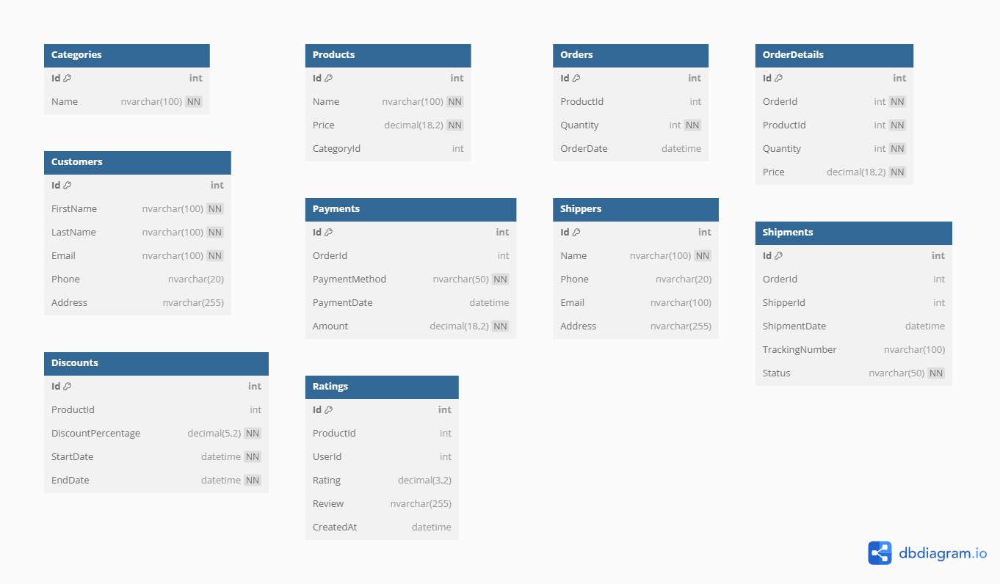

# Dapper CURD
An example project about .Net8 and using Dapper for connecting MS SQL SERVER

## [SQL](database.sql)

## Note
### Make formal ASP.NET Core
  - Using MVC Architecture and RESTful API
### Using Stored Procedures 
  1. Create Procedure on SQL Server
   ```sql
    CREATE PROCEDURE GetOrderDetailById
        @Id INT
    AS
    BEGIN
        SELECT 
    	o.Id AS OrderId,
    	o.Quantity ,
    	o.OrderDate,
    	p.Id AS ProductId,
    	p.Name AS ProductName,
    	p.Price AS ProductPrice,
    	c.Id AS CategoryId,
    	c.Name AS CategoryName
    
    	FROM Orders o
    	JOIN Products p ON o.ProductId = p.Id
    	JOIN Categories c ON p.CategoryId = c.Id
    	WHERE 
    	o.Id = @Id;
    END
   ```
  2. Function in repository
   ```c#
      // Method to get order detail by Id (including Product and Category)
      public async Task<OrderDetail> GetOrderDetailById(int id)
      {
          var detail = await _db.QuerySingleOrDefaultAsync<OrderDetail>("GetOrderDetailById", new { Id = id }, commandType: CommandType.StoredProcedure);
          return detail;
      }
  ```
## Library
- [Dapper](https://github.com/DapperLib/Dapper)
- [.Net8](https://dotnet.microsoft.com/en-us/download/dotnet/8.0)
- [SQLClient](https://github.com/dotnet/SqlClient)
